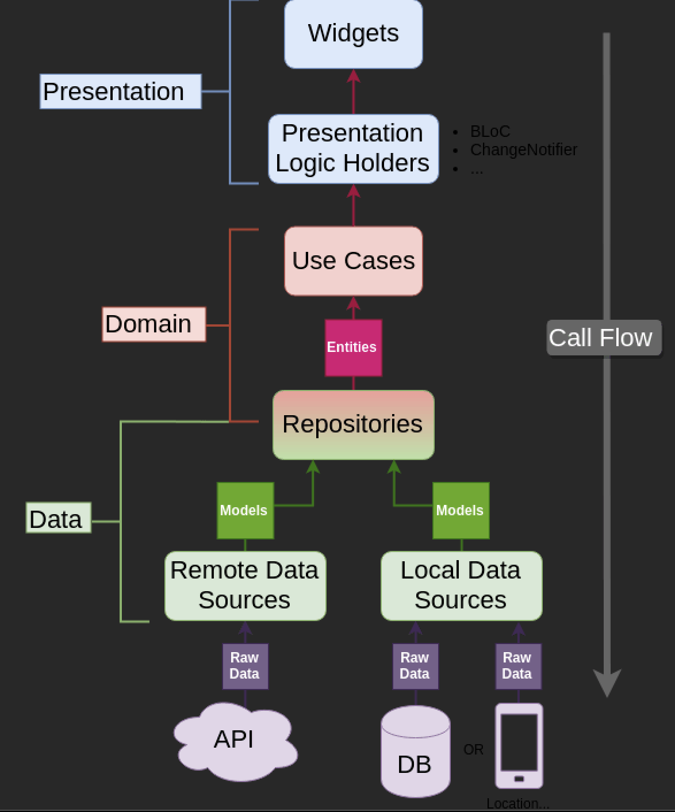

# DogApp | AliG

## Requirements

Business Requirements.

User Story 1: As a customer, I want to view a list of dogs and see details of selected dog. Acceptance Criteria:

- [X] All dog breeds and a link to a picture of each breed will be fetched on the splash screen.
- [X] Dog images should be cached on the splash screen.
- [X] On the home screen, there will be a simple app bar at the top and a bottom bar below. The user will be able to open the home page and settings screen in the bottom bar.
- [X] Dog breeds will be listed with their photos and breed names. These types can be filtered with the input located above the bottom bar.
- [X] Input must be scrollable and extendable.
- [X] When you click on the items, the bottom sheet will appear and a random photo of that type will be generated and shown to the user with the Generate button.
- [X] In the settings, the operating system version section will be pulled from 2 separate platforms as Native and displayed here.

## Running the Code

To run the code, first clone the repository and then run:

```bash
flutter pub get && flutter run
```

## Tests

Tests that are included in the project:

To run tests, run:

```bash
flutter test
```

## Architecture Approach
<p align="left">
    
</p>

### Folder Structure:
    - lib
      - data
        - data_sources
        - models
        - repositories
      - domain
        - usecases
        - repositories
      - presentation
        - bloc
        - components
        - pages

## Used Packages

- bloc: to handle state management
- cached_network_image: to cache dog images
- easy_localization: to localize the app
- dartz: to handle api errors
- equatable: to compare objects
- auto_route: to handle navigation
- dio: to make api calls
- mockito: to mock api calls
- get_it: to handle dependency injection
- shared_preferences: to handle local storage
